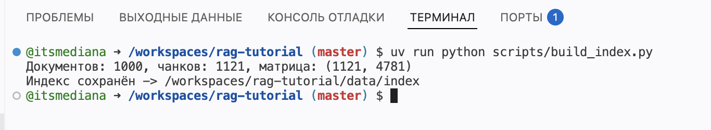
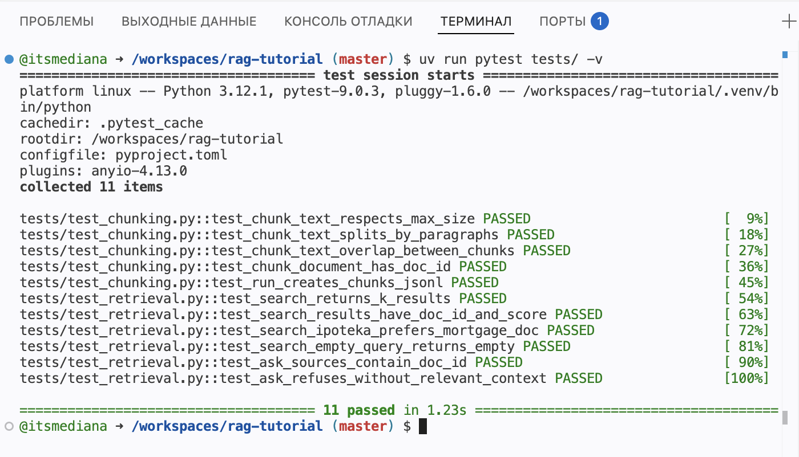
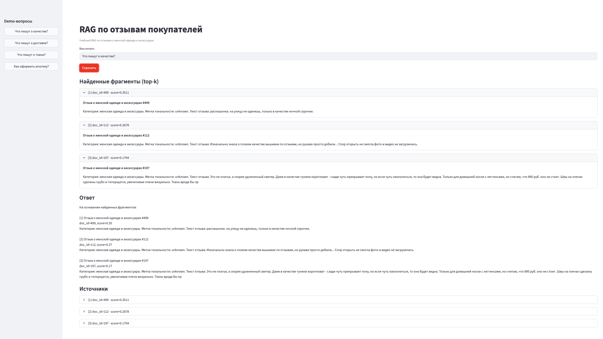
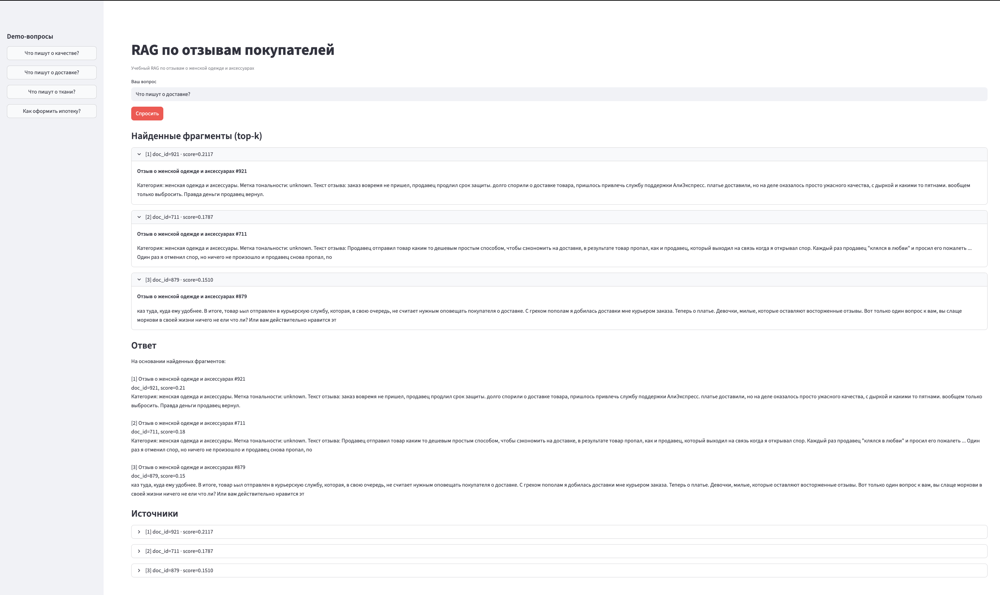
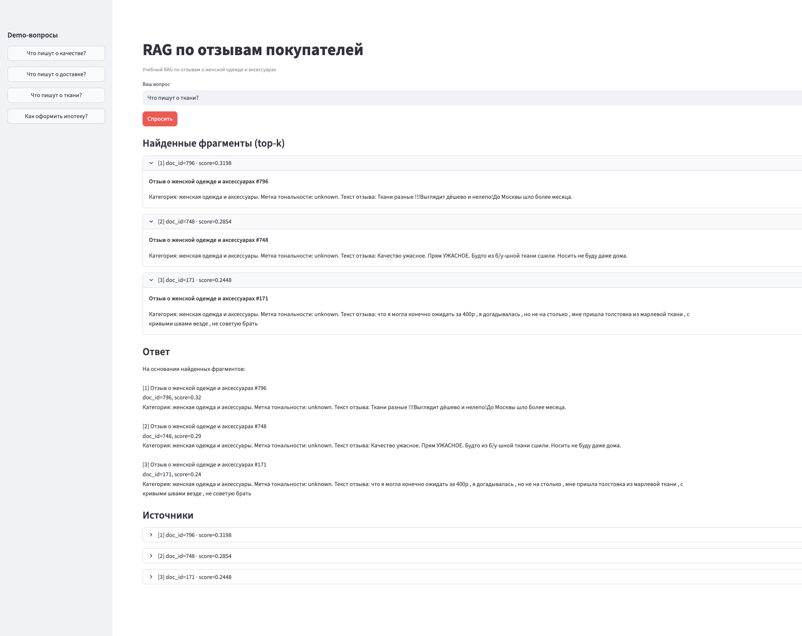
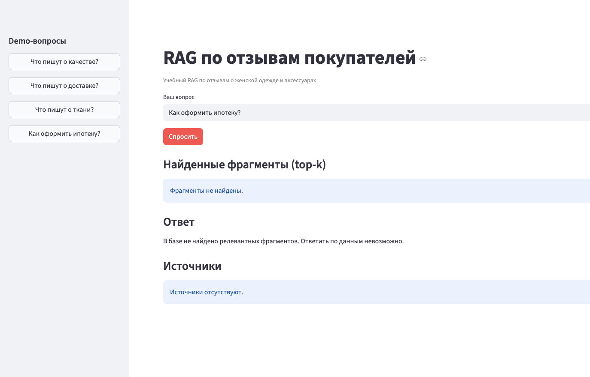

# RAG по отзывам покупателей о женской одежде и аксессуарах

Учебный RAG-проект на русскоязычных отзывах покупателей.

Проект показывает полный pipeline:

```text
данные → документы → чанки → индекс → поиск → demo-ответ с источниками
```

## Что делает проект

Система принимает вопрос пользователя, ищет релевантные фрагменты в отзывах покупателей и показывает demo-ответ на основе найденных источников.

В интерфейсе Streamlit отображаются:

- вопрос пользователя;
- найденные фрагменты top-k;
- `doc_id`;
- `score`;
- текст найденного фрагмента;
- итоговый demo-ответ;
- отказ, если релевантного контекста нет.

## Данные

В проекте используется открытый датасет RuReviews с русскоязычными отзывами о женской одежде и аксессуарах.

Источник: https://github.com/sismetanin/rureviews

В текущей версии в `data/raw/datasets.json` сохранено 1000 текстовых отзывов.

Подробнее данные описаны в файле:

```text
doc/DATA.md
```

## Быстрый старт

```bash
uv sync
uv run python scripts/build_index.py
uv run streamlit run app/main.py
```

После запуска приложение открывается в браузере.  
В GitHub Codespaces нужно открыть forwarded port `8501` или другой порт, указанный Streamlit.

## Demo-вопросы

| Тип вопроса | Вопрос | Ожидание |
|---|---|---|
| Demo | Что пишут о качестве? | Ответ по отзывам про качество товара, внешний вид, пошив или общее впечатление |
| Demo | Что пишут о доставке? | Ответ по отзывам, где покупатели упоминают доставку, сроки или получение заказа |
| Demo | Что пишут о ткани? | Ответ по отзывам, где покупатели описывают ткань, материал или ощущения от товара |
| Negative | Как оформить ипотеку? | Отказ, потому что в данных нет информации об ипотеке |

## Результаты проверки

### Сборка индекса

Индекс был собран командой:

```bash
uv run python scripts/build_index.py
```

Результат:

```text
Документов: 1000, чанков: 1121, матрица: (1121, 4781)
Индекс сохранён -> /workspaces/rag-tutorial/data/index
```

### Тесты

Тесты были запущены командой:

```bash
uv run pytest tests/ -v
```

Результат:

```text
11 passed
```

## Скриншоты проверки

Скриншоты расположены в папке:

```text
doc/screenshots/
```

### 1. Сборка индекса

На скриншоте показана сборка индекса по 1000 документам.



### 2. Прохождение тестов

На скриншоте показан результат запуска тестов.



### 3. Demo-вопрос про качество

На скриншоте показан вопрос `Что пишут о качестве?`, найденные фрагменты, `doc_id`, `score` и demo-ответ.



### 4. Demo-вопрос про доставку

На скриншоте показан вопрос `Что пишут о доставке?`, найденные фрагменты, `doc_id`, `score` и demo-ответ.



### 5. Demo-вопрос про ткань

На скриншоте показан вопрос `Что пишут о ткани?`, найденные фрагменты, `doc_id`, `score` и demo-ответ.



### 6. Negative-вопрос

На скриншоте показан вопрос `Как оформить ипотеку?`. Система не находит релевантные фрагменты и отказывается отвечать по данным.



## Проверка через консоль

```bash
uv run pytest tests/ -v
```

## Ограничения MVP

- Поиск реализован через TF-IDF, поэтому качество зависит от совпадения слов.
- Внешняя LLM не используется.
- Ответ формируется только на основе найденных фрагментов.
- Если релевантных фрагментов нет, система отказывается отвечать.

## Возможные улучшения

- Использовать embeddings вместо TF-IDF для более качественного семантического поиска.
- Добавить LLM-генерацию ответа на основе найденных фрагментов.
- Добавить фильтры по тональности отзывов.
- Добавить отдельную оценку качества retrieval на заранее подготовленных вопросах.
